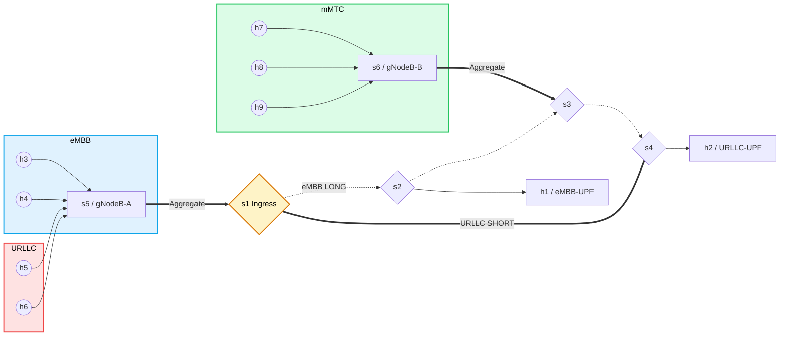

# Astra Mobility 5G SDN Slicing Lab

Mininet + Open vSwitch + RYU network slicing lab emulating a 5G core fabric.
Three slices (eMBB / URLLC / mMTC) share one physical ring with slice-specific routing, queuing, and rate-limiting.



## Architecture & Slicing Design
- **Core ring**: s1-s2-s3-s4 (10 Mbps links, `delay=2ms`)
- **Edge aggregation**: s5 (gNodeB-A) -> s1, s6 (gNodeB-B) -> s3
- **Paths from s5**: 
  - SHORT `s5->s1->s4` (URLLC, via `s1-eth2`)
  - LONG `s5->s1->s2->s3->s4` (eMBB, via `s1-eth1`)
- **Hosts / slices**: h3,h4 -> eMBB; h5,h6 -> URLLC; h7,h8,h9 -> mMTC; h1 = eMBB UPF (s2); h2 = URLLC UPF (s4)

## Prerequisites & Installation (Arch Linux)

| Package | Purpose | Install |
|---|---|---|
| openvswitch | OVS switch 3.7+ | `pacman -S openvswitch` |
| mininet | network emulator | `pacman -S mininet` |
| iperf3 | traffic generation | `pacman -S iperf3` |
| wireshark-cli | tshark DSCP analysis | `pacman -S wireshark-cli` |
| python-ryu | RYU 4.34 controller | `pip install ryu` (venv, Python 3.9) |
| networkx / matplotlib | charts | `pip install networkx matplotlib` |

RYU is installed in a virtualenv (`/home/anuruprkris/Project/ryu-env`, Python 3.9.25). Mininet lives in system python (`/usr/bin/python`); it is NOT in the venv.

## Troubleshooting & Critical Gotchas

> [!WARNING]
> **Broken `env` wrapper**: `/home/anuruprkris/.local/bin/env` shadows coreutils `env` and swallows arguments, which breaks Mininet's host shells. Always invoke Mininet through `/usr/bin/env` explicitly:
> `/usr/bin/env PATH=/usr/local/sbin:/usr/local/bin:/usr/sbin:/usr/bin:/sbin:/bin /usr/bin/python astra_5g_topo.py`

> [!CAUTION]
> **STP Ring Loop**: The ring is a switching loop. If it floods (watch `/tmp/ryu.log` for a packet-in storm), enable STP on every bridge:
> `for s in s1 s2 s3 s4 s5 s6; do ovs-vsctl set bridge $s stp_enable=true; done`

> [!IMPORTANT]
> **Port Map**: s1 has only THREE links — `s1-eth1` (ofport 1, ->s2, LONG/eMBB path), `s1-eth2` (ofport 2, ->s4, SHORT/URLLC path), `s1-eth3` (->s5).

> [!NOTE]
> **RYU ofctl_rest**: Cannot parse OF1.3 `instructions`/`meter` JSON. Meter-bearing eMBB flows must be inserted with `ovs-ofctl`.

## Project Files

| File | Role |
|---|---|
| `astra_5g_topo.py` | Mininet topology (6 switches, 9 hosts, 10 Mbps ring). Run with system python. |
| `astra_controller.py` | RYU app: table-miss, ARP flood, MAC learning, slice-aware reactive priorities. |
| `astra_qos.sh` | Full QoS deployment: HTB queues, meter 100, DSCP/set-queue flows. |
| `astra_monitor.py` | Captures `s1-eth2`/`s1-eth1` with tcpdump, DSCP analysis with tshark, OVS/RYU stats. |
| `astra_perf.py` | 3-phase benchmark (baseline / rate-limited / priority QoS) via host namespaces. |
| `astra_charts.py` | Generates topology + performance PNGs. |
| `astra_results.json` | Stores the throughput and latency results from the performance benchmark. |
| `astra_monitor_output.txt`| Captures the DSCP monitoring stats (Short path vs Long path). |

## Running the Lab

All commands run from `/home/anuruprkris/Project/sdn` as root.

1. **Start the RYU controller** (port 6653, REST on 8080)
   ```bash
   source ../ryu-env/bin/activate
   setsid nohup ryu-manager --verbose astra_controller.py ryu.app.ofctl_rest > /tmp/ryu.log 2>&1 < /dev/null & disown
   ```
2. **Start Mininet** (detached, FIFO-driven CLI)
   ```bash
   rm -f /tmp/mn_fifo && mkfifo /tmp/mn_fifo
   setsid nohup /usr/bin/env PATH=/usr/local/sbin:/usr/local/bin:/usr/sbin:/usr/bin:/sbin:/bin /usr/bin/python astra_5g_topo.py < /tmp/mn_fifo > /tmp/mn.log 2>&1 & disown
   setsid bash -c 'exec 3>/tmp/mn_fifo; sleep 7200' >/dev/null 2>&1 & disown
   ```
3. **Deploy slice QoS**
   ```bash
   bash astra_qos.sh
   ```
4. **Monitor slice separation** (tcpdump + tshark)
   ```bash
   source ../ryu-env/bin/activate
   python astra_monitor.py
   ```
5. **Run the performance benchmark**
   ```bash
   source ../ryu-env/bin/activate
   python astra_perf.py
   ```
6. **Generate Charts**
   ```bash
   source ../ryu-env/bin/activate
   python astra_charts.py
   ```

## Observed Results (Performance)

| Metric | Baseline | Rate-limited | Priority QoS |
|---|---|---|---|
| URLLC throughput | 1.36 Mbps | 8.28 Mbps | 5.39 Mbps |
| URLLC avg latency | 2133.9 ms | 117.9 ms | 51.7 ms |
| URLLC jitter | 237.1 ms | 167.0 ms | 108.8 ms |
| eMBB throughput | 9.50 Mbps | 2.61 Mbps | 3.29 Mbps |

*Note: URLLC latency improved ~41x from Baseline to Priority QoS.*
